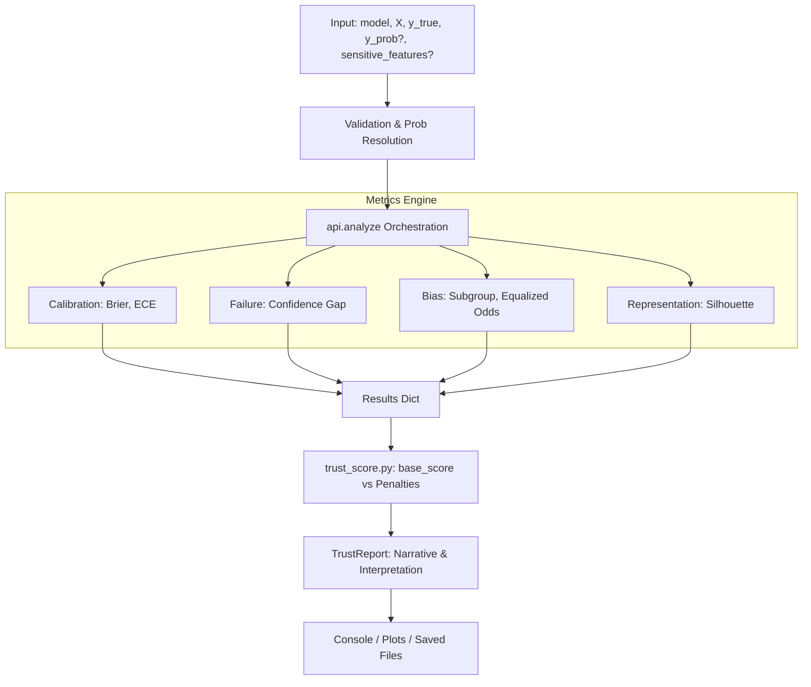
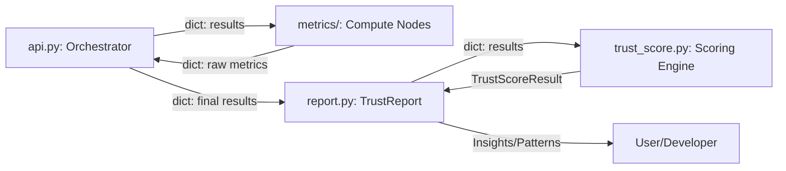
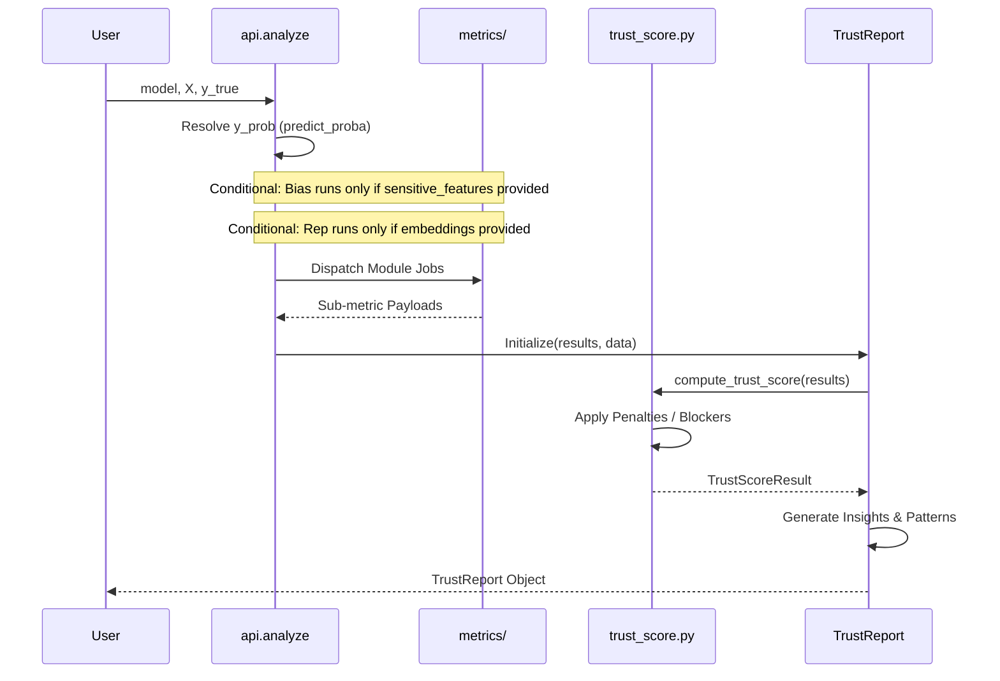

# System Architecture

TrustLens is designed as a layered pipeline so diagnostic computation, scoring logic, and report interpretation remain decoupled and maintainable.

## Why This Design Matters

The architecture aims to solve three practical needs:

- stable and testable metric computation
- explicit decision logic with traceable rules
- clear extension points for contributors

## High-Level Data Flow

This diagram shows how inputs move from orchestration to metrics, scoring, and final reporting.

**Implementation note**: `analyze()` resolves probabilities from `predict_proba` when available and only executes optional modules when required metadata is provided.

## Component Interactions

The interaction model is centered around a structured `results` dictionary.

### Data Contracts

1. **API to metrics**: normalized arrays (`y_true`, `y_pred`, `y_prob`) and optional metadata.
2. **Metrics to API**: module-scoped dictionaries with scalar values and plot-friendly arrays.
3. **API to report**: consolidated `results` plus model and data references.
4. **Report to scorer**: score computation from `results` including penalties and blockers.

## Execution Sequence

This sequence shows one `analyze()` call from input to `TrustReport`.

## Layer Responsibilities

### Orchestration Layer (`api.py`)

- validates basic input assumptions
- resolves probabilities when possible
- dispatches enabled modules
- assembles the final `results` payload

### Metrics Layer (`metrics/`)

- computes calibration, failure, bias, and representation diagnostics
- keeps each metric family independent and testable
- returns structured outputs for scoring and visualization

### Scoring Layer (`trust_score.py`)

- computes sub-scores and weighted composite score
- redistributes weights for missing dimensions
- applies penalties and deployment blockers

### Reporting Layer (`report.py`)

- packages run metadata and module outputs
- generates textual and visual summaries
- surfaces patterns and decision-oriented insights

### Comparison Layer (`comparison.py`)

- compares candidate `TrustReport` objects
- filters blocked candidates
- provides deployment recommendation rationale

## Extensibility Path

To add a new metric module:

1. implement the metric under `trustlens/metrics/`
2. wire dispatch logic in `analyze()`
3. ensure return format follows existing `results` conventions
4. add tests and documentation
5. optionally integrate into trust score weighting

## Architectural Constraints

- optimized for classification evaluation
- fairness checks are data- and task-dependent
- representation diagnostics require embeddings
- some threshold logic is currently heuristic by design

## Related Pages

- [Features and Modules](features.md)
- [Trust Score Explained](trust_score_explained.md)
- [Known Limitations](known_limitations.md)
- [Experimental Modules](EXPERIMENTAL.md)
