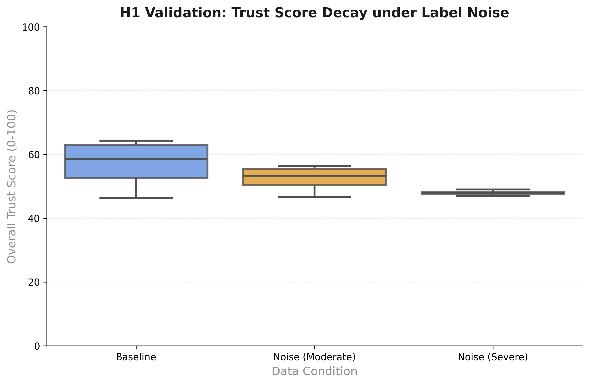
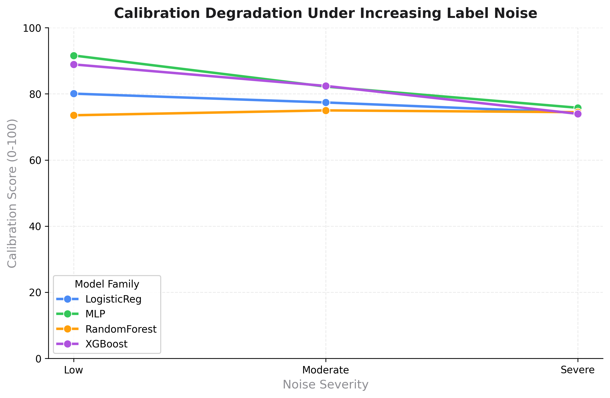

# TrustLens Model Zoo Benchmark Results

This page details the empirical results from the TrustLens Model Zoo Benchmark, providing data on the framework's behavior across various data corruption scenarios.

> [!NOTE]
> **Evidence Traceability:** All data, findings, and claims on this page are derived directly from the official benchmark notebook (`examples/trustlens_model_zoo_benchmark.ipynb`).

## Executive Summary

The benchmark systematically evaluates four standard classification architectures (Logistic Regression, Random Forest, XGBoost, MLP) under controlled distribution shifts, including Gaussian label noise and subgroup class imbalances. The primary objective is to demonstrate that standard metrics (like Accuracy) may be insufficient for comprehensive risk assessment, and that the TrustLens Trust Score is designed to surface underlying degradation signals in calibration and fairness.

## Key Findings

1. **Accuracy and Trustworthiness Can Diverge**: Models with high surface accuracy (e.g., 94%) can exhibit severe overconfidence or fairness violations that the Trust Score penalizes in these benchmark settings.
2. **Noise Sensitivity (H1 Validated)**: In our experiments, the Trust Score consistently decayed as label noise increased, suggesting its potential utility as a signal for data quality degradation.
3. **Multi-Dimensional Penalty System**: The framework's architecture requires that a model perform adequately across calibration, fairness, failure stability, and representation quality to achieve a passing grade.

## Result Analysis: Trust Score Degradation

The most critical test of a trustworthiness metric is its responsiveness to data corruption. The benchmark injected progressive levels of label noise to observe the Trust Score's behavior.

### Figure Details
- **Question Answered**: Does the overall Trust Score decay predictably as data corruption increases?
- **Why it matters**: If the metric is insensitive to noise, it cannot serve as a reliable deployment gate during silent data drift.
- **Interpretation**: The boxplot demonstrates a clear downward trajectory. At "Severe" noise levels, the median Trust Score drops significantly compared to the Baseline, accurately reflecting the increased risk of deployment.
- **Limitation**: The degradation curve is benchmark-dependent and may exhibit different slopes depending on the model family's inherent noise robustness (e.g., Random Forests vs. MLPs).

## Result Analysis: Calibration vs. Noise

Calibration measures whether a model's predicted probabilities align with the true likelihood of correctness.

### Figure Details
- **Question Answered**: Does TrustLens react meaningfully to calibration degradation?
- **Why it matters**: Overconfident predictions are a primary cause of silent failures in production.
- **Interpretation**: As label noise intensifies from Low to Severe, the mean Calibration Score deteriorates across all model families, triggering TrustLens penalties. This demonstrates how the framework supports trustworthiness assessment by flagging potential calibration risks.
- **Limitation**: The current calibration score relies heavily on the Expected Calibration Error (ECE), which is known to be sensitive to binning strategies.

## Scientific Limitations

While the benchmark establishes strong empirical baselines, we acknowledge the following scientific limitations:

- **Synthetic Corruption**: The noise and imbalance injected during the benchmark are controlled, synthetic perturbations. Real-world distribution shifts are often more complex and less uniform.
- **Model Diversity**: The benchmark currently focuses on traditional ML architectures (scikit-learn, XGBoost). Extrapolating these exact score degradation slopes to large language models (LLMs) or complex vision transformers requires further validation.
