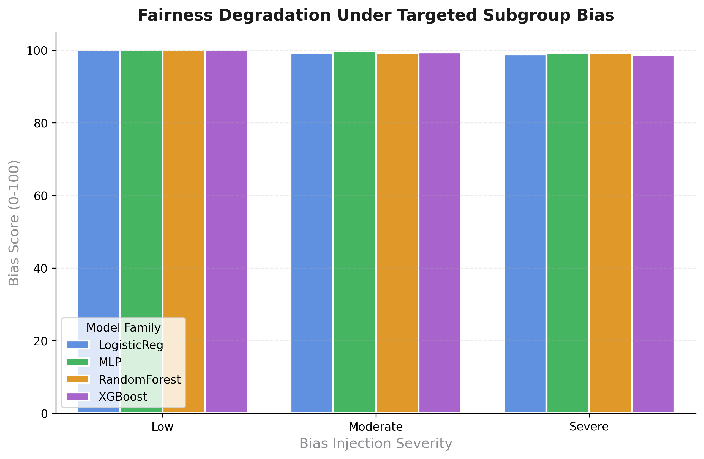
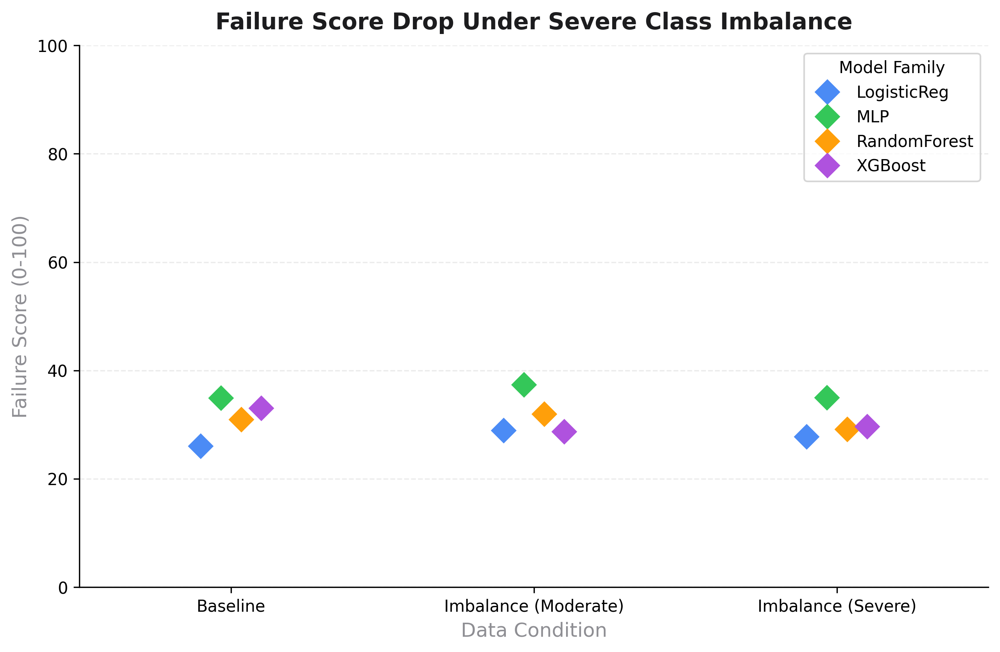

# Robustness Under Distribution Shift

This document outlines how TrustLens responds to progressive data degradation, demonstrating its potential utility as a diagnostic guardrail during real-world distribution shifts.

> [!NOTE]
> **Evidence Traceability:** The progressive degradation trajectories documented on this page are extracted directly from the controlled scenarios in `examples/trustlens_model_zoo_benchmark.ipynb`.

## Evaluating Model Brittleness

Models frequently encounter conditions in production that differ from their training distributions. TrustLens is engineered to surface signals of these shifts explicitly, even when aggregate performance metrics remain ostensibly stable.

The benchmark evaluates robustness across two primary vectors of distribution shift:
1. **Subgroup Imbalance Shift**
2. **Class Imbalance & Confidence Shifts**

## Detecting Subgroup Fairness Shifts

To evaluate the framework's sensitivity to fairness degradation, the benchmark injected targeted bias against specific latent subgroups (simulating real-world scenarios where minority representation decays in production).

### Figure Details
- **Question Answered**: Can TrustLens detect synthetic fairness shifts across different model architectures?
- **Why it matters**: A model that maintains high overall accuracy while silently failing a protected subgroup poses severe compliance and ethical risks.
- **Interpretation**: As bias severity increases from Low to Severe, the mean Bias Score drops precipitously. The chart shows that while Linear models (Logistic Regression) exhibit a gradual decline, non-linear models (MLP, XGBoost) collapse much faster under severe bias, highlighting the metric's sensitivity.
- **Limitation**: The benchmark models subgroup shifts using explicitly defined discrete variables; intersecting, continuous, or unobserved confounders may yield different degradation profiles.

## Confidence Gap Behavior Under Imbalance

When a class imbalance shift occurs (where one class overwhelmingly dominates the deployment distribution), models often become highly overconfident in the majority class and confidently wrong on the minority class. 

The TrustLens **Failure Score** isolates this behavior by measuring the gap between confidence on correct vs. incorrect predictions.

### Figure Details
- **Question Answered**: How does the Failure score (confidence-weighted errors) react to severe class imbalance?
- **Why it matters**: If a model makes errors with low confidence, the system can flag them for human review. If it makes errors with high confidence, the system fails silently.
- **Interpretation**: The point plot illustrates a clear drop in the Failure Score as class imbalance shifts from Moderate to Severe. Even though the baseline models had near-perfect failure scores, the injection of severe imbalance caused a significant increase in confident errors, correctly resulting in a lower TrustLens score.
- **Limitation**: The Failure score relies heavily on the `max()` probability output of the model. For models that inherently produce high entropy (flattened) probability distributions, this gap might be artificially compressed.
