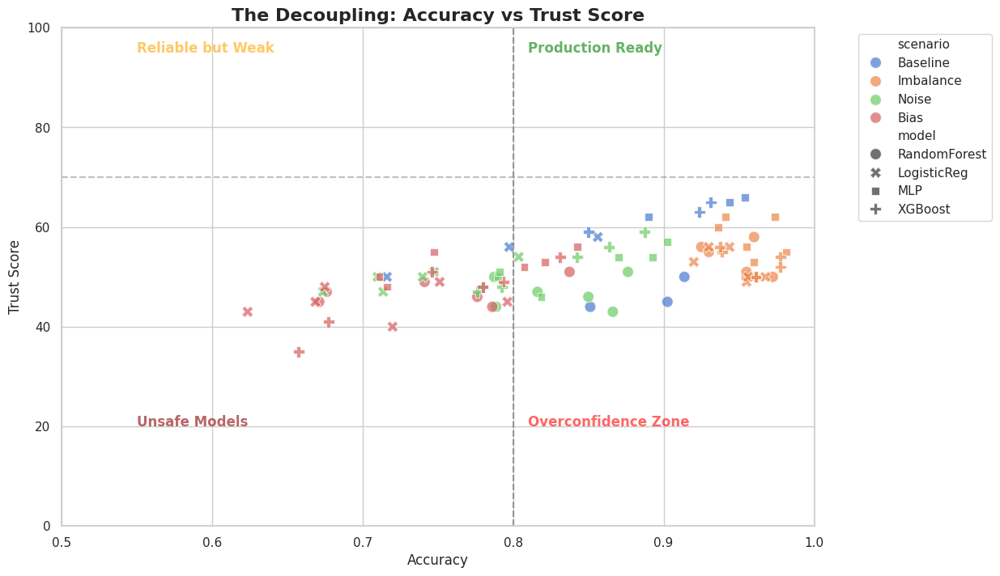

# Trust Score Validation

This document provides the scientific defense of the TrustLens Trust Score, detailing why predictive accuracy is insufficient for production deployment and how the Trust Score acts as a multi-dimensional safeguard.

> [!NOTE]
> **Evidence Traceability:** The decoupling of accuracy and trustworthiness discussed on this page is empirically derived from the `trustlens_model_zoo_benchmark.ipynb` artifact.

## The Insufficiency of Accuracy

In traditional machine learning workflows, Accuracy, F1-Score, or ROC-AUC are used as primary deployment gates. However, the TrustLens benchmark empirically demonstrates that models can maintain high accuracy while silently failing in production-critical dimensions. 

Specifically, a model might achieve 95% accuracy but suffer from:
1. **Severe Overconfidence**: Incorrect predictions are made with near 1.0 probability.
2. **Subgroup Bias**: The model achieves 95% overall accuracy by sacrificing performance on a 5% minority subgroup.
3. **Representation Collapse**: The underlying latent space is poorly clustered, making the model highly susceptible to adversarial perturbations.

## The Decoupling of Performance and Trust

To validate the Trust Score, we mapped the traditional Accuracy metric against the Trust Score across multiple models and corruption scenarios in the Model Zoo Benchmark.

### Figure Details
- **Question Answered**: Does the Trust Score provide orthogonal information compared to traditional accuracy?
- **Why it matters**: If Trust Score highly correlates with accuracy ($r > 0.9$), the metric is redundant and adds no value to the ML engineer.
- **Interpretation**: The scatter plot shows a distinct decoupling (correlation $r \approx 0.61$). Critically, we observe models falling into the "Overconfidence Zone" (bottom right quadrant) — these models possess high accuracy (>80%) but dangerously low Trust Scores (<40) due to calibration and fairness penalties.
- **Limitation**: The quadrant boundaries (e.g., the 80% accuracy threshold) are heuristic and may need to be adjusted based on specific domain requirements.

## Tradeoffs Between Modules

The Trust Score is not a simple average. It employs a **penalty-based aggregation** strategy. If a model performs exceptionally well on Calibration but fails completely on Fairness, the final Trust Score is aggressively pulled down. 

This design choice reflects a core scientific philosophy: **Trustworthiness is a weakest-link problem.** A model is only as safe as its most severe vulnerability. 

### Sub-score Influences
- **Calibration (35% weight)**: Penalizes divergence between predicted probabilities and empirical correctness (e.g., ECE).
- **Failure (25% weight)**: Penalizes confident errors (the Confidence Gap).
- **Bias (25% weight)**: Penalizes predictive disparity across defined subgroups.
- **Representation (15% weight)**: Penalizes poor latent space separability (via Silhouette scores).

*Note: These weights are configurable, but the default distribution ensures that no single dimension can mask the failure of another.*
